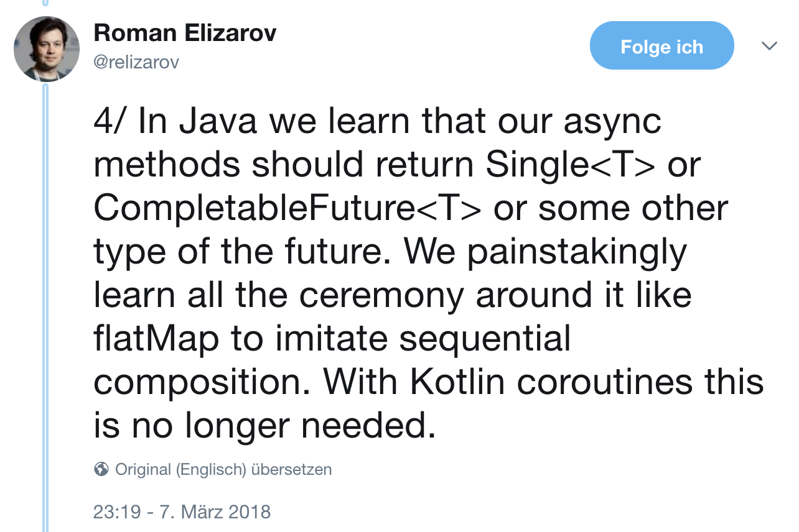
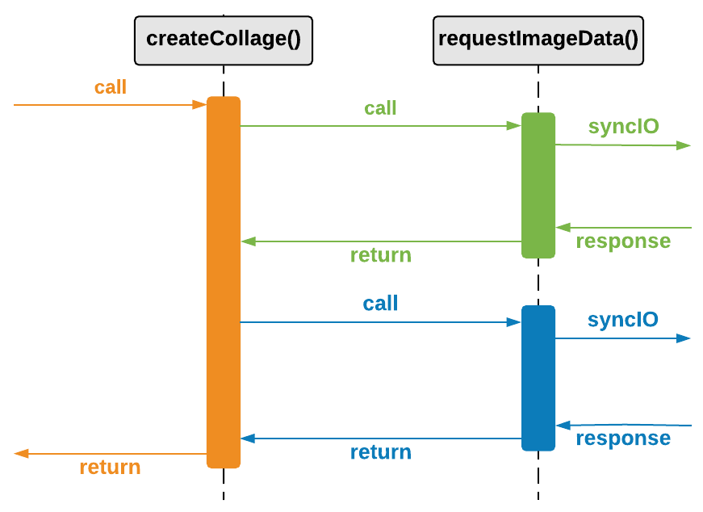
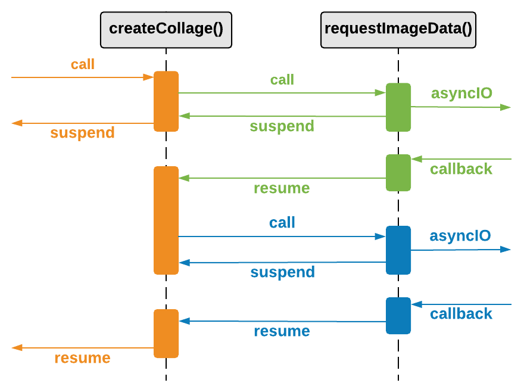
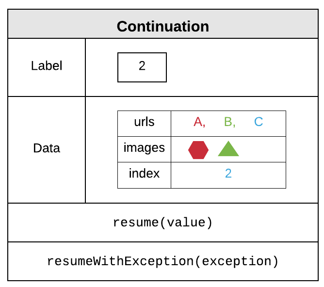
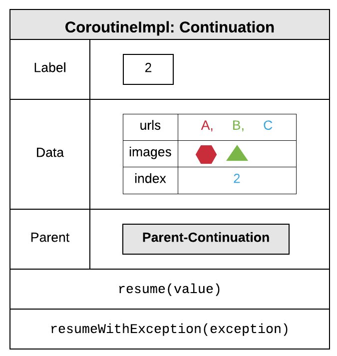
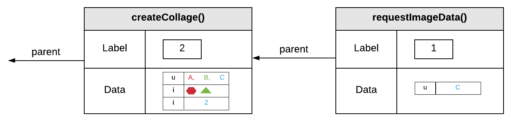
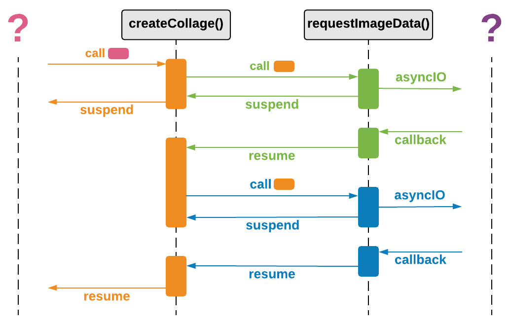

##### Arbeiten mit Threads

```kotlin
fun loadOneImage(query: String): BufferedImage {
    val url = requestImageUrl(query)
    val image = requestImageData(url)
    return image
}
```
<small class="fragment current-only" data-code-focus="2-3">Thread muss auf IO warten </small>

---

##### Callbacks

```kotlin
fun loadOneImage(
    query: String,
    onFailure: OnFailure = {},
    onSuccess: OnSuccess<BufferedImage>
): Unit {
    requestImageUrl(query, onFailure) { url ->
        requestImageData(url, onFailure) { image ->
            onSuccess(image)
        }
    }
}
```
<small class="fragment current-only" data-code-focus="6-10">Funktion kehrt ohne Return-Wert sofort zurück</small>
<small class="fragment current-only" data-code-focus="7-9">Callback wird nach IO aufgerufen</small>
<small class="fragment current-only" data-code-focus="4,8">Am Ende den eigenen Callback aufrufen</small>

---

##### Futures / Promises

```kotlin
fun loadOneImage(query: String): CompletableFuture<BufferedImage> {
    return requestImageUrl(query)
        .thenCompose{ requestImageData(it) }
}
```
<small class="fragment current-only" data-code-focus="1">Funktion liefert ein Future zurück</small>
<small class="fragment current-only" data-code-focus="3">Funktionale Welt mit Operatoren / Kombinatoren</small>

---

##### Komplexeres Beispiel - Kollage

```kotlin
fun createCollage(query: String, count: Int): BufferedImage {
    val urls = requestImageUrls(query, count)
    val images = urls.map { requestImageData(it) }
    val newImage = combineImages(images)
    return newImage
}
```
<small class="fragment current-only" data-code-focus="2">Ermittle mehrere Bild-URLs</small>
<small class="fragment current-only" data-code-focus="3">Pro URL ein Request - Ausführung sequentiell</small>
<small class="fragment current-only" data-code-focus="2-3"></small>

---

##### Kollage mit Callbacks

```kotlin
fun createCollage(query: String, count: Int, onSuccess: OnSuccess<BufferedImage>) {
    requestImageUrls(query, count) { urls ->
        fun loadImages(
            urlIter: Iterator<String>,
            retrievedImages: List<BufferedImage>
        ) {
            if (urlIter.hasNext()) {
                requestImageData(urlIter.next()) { image ->
                    loadImages(urlIter, retrievedImages + image)
                }
            } else {
                onSuccess(combineImages(retrievedImages))
            }
        }
        loadImage(urls.iterator(), listOf())
    }
}
```

<small class="fragment current-only" data-code-focus="2,8"></small>
<!--
<span class="fragment current-only" data-code-focus="2-16"></span>
<span class="fragment current-only" data-code-focus="3-14"></span>
<span class="fragment current-only" data-code-focus="4"></span>
<span class="fragment current-only" data-code-focus="5"></span>
<span class="fragment current-only" data-code-focus="15"></span>
<span class="fragment current-only" data-code-focus="7"></span>
<span class="fragment current-only" data-code-focus="8-10"></span>
<span class="fragment current-only" data-code-focus="9"></span>
<span class="fragment current-only" data-code-focus="12"></span>
-->

---

##### Kollage mit Futures

```kotlin
fun createCollage(query: String, count: Int): CompletableFuture<BufferedImage> {
    return requestImageUrls(query, count)
        .thenCompose {urls ->
            val startFuture = completedFuture<List<BufferedImage>>(listOf())
            urls.fold(startFuture) { lastFuture, url ->
                lastFuture.thenCompose { images ->
                    requestImageData(url).thenApply { image ->
                        images + image
                    }
                }
            }
        }.thenApply(::combineImages)
}
```
<small class="fragment current-only" data-code-focus="2,7"></small>
<small class="fragment current-only" data-code-focus="3,5,6,7,12">Kombinatoren</small>

<!--
<small class="fragment current-only" data-code-focus="3-11">Es muss eine Abfolge von Futures erzeugt werden.</small>
<small class="fragment current-only" data-code-focus="4">Starte mit einer leeren Liste.</small>
<small class="fragment current-only" data-code-focus="5"></small>
<small class="fragment current-only" data-code-focus="6-10">Hänge ein neues Future an das vorherige Future.</small>
<small class="fragment current-only" data-code-focus="7-9"></small>
<small class="fragment current-only" data-code-focus="12"></small>
-->

---

##### Kollage mit Koroutinen

<pre class="fragment" data-fragment-index="3">
<code class="kotlin">suspend fun requestImageUrls(query: String, count: Int = 20): List<String>
suspend fun requestImageData(imageUrl: String): BufferedImage</code></pre>


```kotlin
suspend fun createCollage(query: String, count: Int): BufferedImage {
    val urls = requestImageUrls(query, count)
    val images = urls.map { requestImageData(it) }
    val newImage = combineImages(images)
    return newImage
}
```

<small class="fragment current-only" data-code-focus="3,4" data-fragment-index="1"></small>  
<small class="fragment current-only" data-code-focus="2" data-fragment-index="2">__suspend__ macht den Unterschied</small>  

---

##### Einfache asynchrone Sequenzen



---

##### Koroutinen

 * Melvin Conway 1963
 * Kooperative Übergabe des Kontrollflusses
 * Koroutinen sind *sequentiell* per Default

---

##### Funktionen / Routinen



---

##### Koroutinen



---

##### Stackless vs Stackfull 

<ul>
<li class="fragment">Stackless: Suspendierungen sind nur __direkt__ in Koroutinen möglich</li>
<li class="fragment">Stackfull: Suspendierungen sind __überall__ möglich</li>
<li class="fragment">Kotlin implementiert __stackless__ Koroutinen</li>
</ul>

---

##### Continuations

```kotlin
suspend fun createCollage(query: String, count: Int): BufferedImage {
    val urls = requestImageUrls(query, count) //Label 0
    val images = mutableListOf<BufferedImage>() //Label 1
    for (index in 0 until urls.size) {
        val image = requestImageData(urls[index])
        images += image //Label 2
    }
    val newImage = combineImages(images)
    return newImage
}
```
<small class="fragment current-only" data-code-focus="4-7"></small>
<small class="fragment current-only" data-code-focus="2-9"></small>
<small class="fragment current-only" data-code-focus="3-9"></small>
<small class="fragment current-only" data-code-focus="6-9"></small>

---



---

##### Kotlin Compiler

Aus:

```kotlin
suspend fun createCollage(
    query: String, count: Int
): BufferedImage
```

wird:

```kotlin
fun createCollage(
    query: String, count: Int,
    parentContinuation: Continuation<BufferedImage>
): Any // BufferedImage | COROUTINE_SUSPENDED {
  val cont = CoroutineImpl(parentContinuation) //Implements Continuation
```
<span class="fragment current-only" data-code-focus="6,7"></span>
<span class="fragment current-only" data-code-focus="8"></span>

---



---

##### Continuations-Stack



---

##### Koroutinen


---

##### Einstieg und Absprung?




---

##### Builder - Einstieg in Koroutinen

```kotlin
//Startet die Koroutine und "blockiert" den aktuellen Thread
val collage = runBlocking {
    createCollage("dogs", 20)
}

//Startet die Koroutine und setzt den aktuellen Thread fort
val job = launch {
    val collage = createCollage("dogs", 20)
    ImageIO.write(collage, "png", FileOutputStream("dogs.png"))
}

//Stoppt die Koroutine
job.cancel()
```

<span class="fragment current-only" data-code-focus="2-4"></span>
<span class="fragment current-only" data-code-focus="7-10"></span>
<span class="fragment current-only" data-code-focus="13"></span>

---

##### CoroutineContext

```kotlin
//Den Fork-Join-Pool für die Koroutine nutzen
val collage = runBlocking(CommonPool) {
    createCollage("dogs", 20)
}

//Einen eigenen Thread-Pool für die Koroutine nutzen
val fixedThreadPoolContext = newFixedThreadPoolContext(1, "collage")
val job = launch(fixedThreadPoolContext) {
    val collage = createCollage("dogs", 20)

    // Wechsel in den UI-Thread und zurück
    withContext(UI) {
        ImageIO.write(collage, "png", FileOutputStream("dogs.png"))
    }
}
```

<span class="fragment current-only" data-code-focus="2"></span>
<span class="fragment current-only" data-code-focus="7,8"></span>
<span class="fragment current-only" data-code-focus="12"></span>

---

##### Integration mit asynchronen Libraries

```kotlin
JerseyClient.pixabay("q=$query&per_page=$count").request()
    .async()
    .get(object : InvocationCallback<String> {
        override fun completed(response: String) {
          val urls = JsonPath.read<List<String>>(response, "$..previewURL")
          ...
        }

        override fun failed(throwable: Throwable) {
          ...
        }
    })

```

<small class="fragment current-only" data-code-focus="1"></small>
<small class="fragment current-only" data-code-focus="2">Asynchrone API von Jersey nutzen.</small>
<small class="fragment current-only" data-code-focus="3,4,9">Übergabe eines Callbacks für das Ergebnis und die Fehler.</small>
<small class="fragment current-only" data-code-focus="6,10">Hier muss mit den Koroutinen interagiert werden.</small>

---

##### Absprung zu asynchronen Libraries

```kotlin
suspendCoroutine<List<String>> { continuation ->
    JerseyClient.pixabay("q=$query&per_page=$count").request().async()
        .get(object : InvocationCallback<String> {
            override fun completed(response: String) {
                val urls = JsonPath.read<List<String>>(response, "$..previewURL")
                continuation.resume(urls)
            }

            override fun failed(throwable: Throwable) {
                continuation.resumeWithException(throwable)
            }
        })
}
```

<small class="fragment current-only" data-code-focus="1">Suspendierung vorbereiten und Continuation erhalten.</small>
<small class="fragment current-only" data-code-focus="6,10">Im Callback die Continuation erneut starten.</small>
