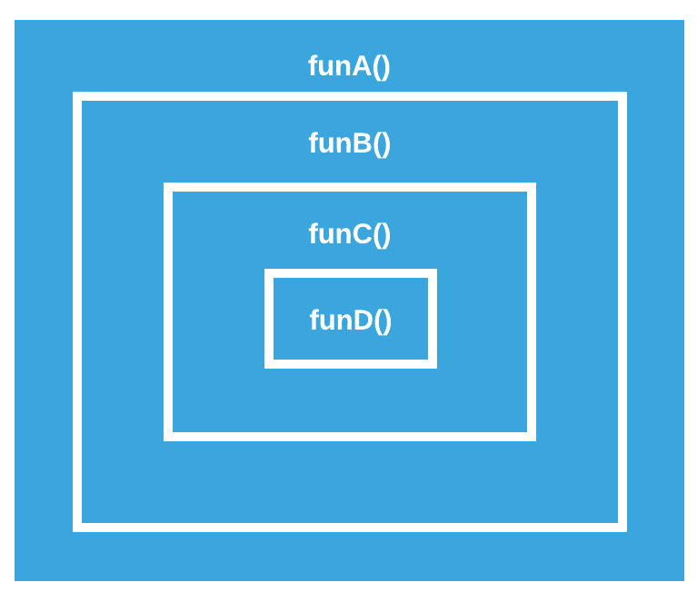
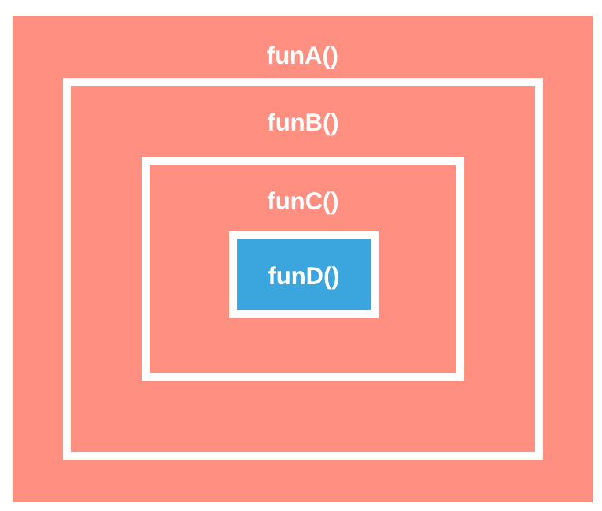

### Zusammenfassung

<ul>
<li>__```suspend```__ konvertiert Funktionen zu Koroutinen</li>
<li class="fragment">Sequential by Default / Asynchronous explicitly</li>
<li class="fragment"> Asynchronen Kommunikationsmustern als Library</li>
<li class="fragment"> Einfache Integration in vorhandene asynchrone APIs</li>
<li class="fragment"> Tooling / Debugging muss noch verbessert werden</li>
<li class="fragment"> Stackless: Suspendierungen nur in Koroutinen möglich<br/> [(Red/Blue Code Problem)](http://journal.stuffwithstuff.com/2015/02/01/what-color-is-your-function/)</li>
</ul>

---

#### Alles Routinen
  



---

#### C() wird zur Koroutine



Note:
48min

---

### Ausblick

 * Stackfull-Koroutinen durch __Quasar__:
https://github.com/puniverse/quasar

 * Oder durch Project __Loom__:
 http://cr.openjdk.java.net/~rpressler/loom/Loom-Proposal.html
 https://www.youtube.com/watch?v=fpyub8fbrVE

Note:
50min

---

### Fragen?

<br/>
<br/>
<br/>

[@RenePreissel](https://twitter.com/RenePreissel)
<br/>
[rene.preissel@etosquare.de](mailto:rene.preissel@etosquare.de)
<br/>
[www.etosquare.de](http://www.etosquare.de)
<br>
<br>
https://github.com/rpreissel/kotlin-coroutine.git