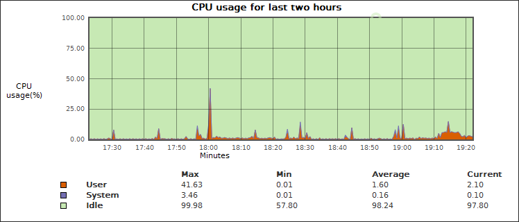
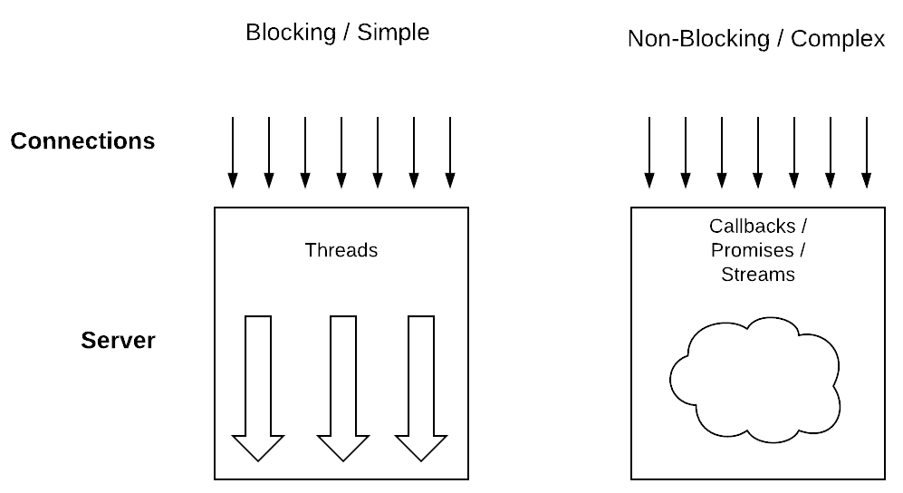
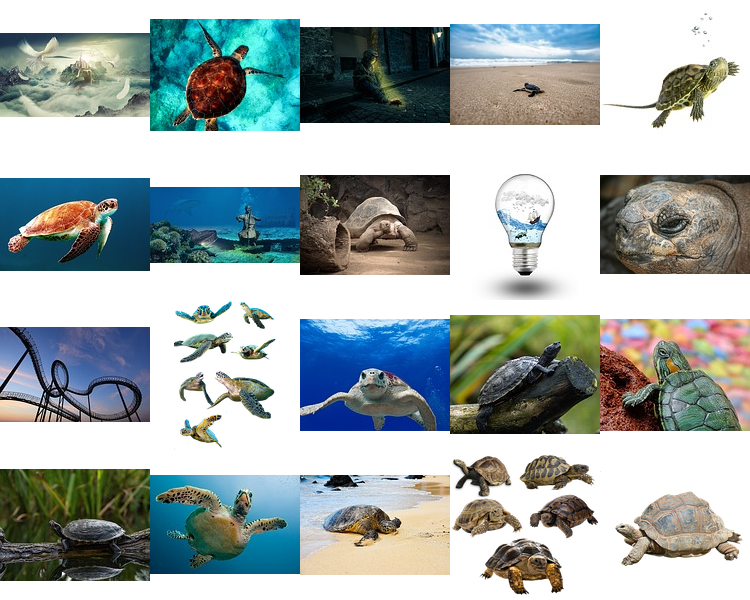

## Koroutinen mit Kotlin

JavaLand, 2018

[@RenePreissel](https://twitter.com/RenePreissel)

<br/>
<br/>
<br/>
<br/>

<small>https://github.com/rpreissel/kotlin-coroutine.git</small>

---

### Inhalt

<br/>

* Warum Koroutinen?
* Umsetzung von Koroutinen in Kotlin
* Asynchrone Kommunikationsmuster mit Koroutinen

---

### Warum?



Note:


---

### Entscheidung?



Note:
3 min

---

### Beispiel

 

 ```kotlin
 val collage = createCollage("turtle", 20)
 ```
