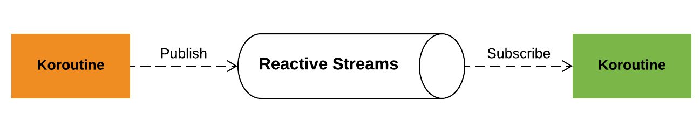

#### Asynchrone Muster / Konzepte in Kotlin

<ul>
<li class="fragment">Sequential by default</li>
<li class="fragment">Asynchronous explicitly</li>
<li class="fragment">Libraries not language</li>
</ul>

---

##### Sequential by default

```kotlin
suspend fun createCollage(query: String, count: Int): BufferedImage {
    val urls = requestImageUrls(query, count)
    val images = urls.map { requestImageData(it) }
    val newImage = combineImages(images)
    return newImage
}
```

<small class="fragment current-only" data-code-focus="2-3"></small>

---

##### Async / Await explizit

```kotlin
suspend fun createCollageAsyncAwait(
    query: String, count: Int
): BufferedImage {
    val urls = requestImageUrls(query, count)
    val deferredImages: List<Deferred<BufferedImage>> = urls.map {
        async {
            requestImageData(it)
        }
    }

    val images: List<BufferedImage> = deferredImages.map { it.await() }

    val newImage = combineImages(images)
    return newImage
}
```

<small class="fragment current-only" data-code-focus="6-8">Explizites starten einer asynchronen Koroutine.</small>
<small class="fragment current-only" data-code-focus="5">Ergebnisse sind Deferred (Futures).</small>
<small class="fragment current-only" data-code-focus="11">Explizites warten auf die Ergebnisse.</small>

---

##### Auf das erste Ereignis warten - Select

```kotlin
suspend fun loadFastestImage(query: String, count: Int): BufferedImage {
    val urls = requestImageUrls(query, count)
    val deferredImages = urls.map {
        async { requestImageData(it) }
    }
    val image: BufferedImage = select {
        for (deferredImage in deferredImages) {
            deferredImage.onAwait { image ->
                image
            }
        }
    }
    return image
}
```
<small class="fragment current-only" data-code-focus="3-5"></small>
<small class="fragment current-only" data-code-focus="6">```select``` überwacht mehrere Ereignisse.</small>
<small class="fragment current-only" data-code-focus="8-10">```onAwait``` anstelle von ```await```</small>

---

##### Communicating sequential processes / CSP

<ul>
  <li>Concurrency Theory</li>
  <li>Pragmatisch: <br/>Kommunikation per Nachrichten über Kanäle </li>   

  <li class="fragment">In Kotlin:  ```Channel```</li>
  <li class="fragment">Ein ```Channel``` entspricht einer ```BlockingQueue```<br/> nur ohne blockieren</li>
</ul>

---

##### Nachrichten senden

```kotlin
suspend fun retrieveImages(query: String, channel: SendChannel<BufferedImage>) {
    while (true) {
        val url = requestImageUrl(query)
        val image = requestImageData(url)
        channel.send(image)
        delay(2, TimeUnit.SECONDS)
    }
}
```
<small class="fragment current-only" data-code-focus="1"></small>
<small class="fragment current-only" data-code-focus="5">Suspendieren wenn der Channel nichts aufnehmen kann (**Back-Pressure**).</small>

---

##### Nachrichten empfangen

```kotlin
suspend fun createCollage(channel: ReceiveChannel<BufferedImage>, count: Int) {
    var imageId = 0
    while (true) {
        val images = (1..count).map {
            channel.receive()
        }
        val collage = combineImages(images)
        ImageIO.write(collage, "png", FileOutputStream("image-${imageId++}.png"));
    }
}
```
<small class="fragment current-only" data-code-focus="1"></small>
<small class="fragment current-only" data-code-focus="5">Suspendieren wenn im Channel nichts vorhanden ist.</small>

---

##### Channel

```kotlin
val channel = Channel<BufferedImage>()
launch(Unconfined) {
    retrieveImages("dogs", channel)
}

launch(Unconfined) {
    retrieveImages("cats", channel)
}

launch(Unconfined) {
    createCollage(channel, 4)
}
```
<small class="fragment current-only" data-code-focus="1">Ein Channel ist zum Senden und Empfangen bereit.</small>
<small class="fragment current-only" data-code-focus="3,7,11"></small>
<small class="fragment current-only" data-code-focus="2,6,10">```Unconfined``` benutzt den Thread, der die Koroutine startet bzw. wiederaufnimmt.</small>

---

##### Unconfined und Rendezvous

```
"jersey-client-async-executor-2@3321" prio=5 tid=0x13 nid=NA runnable
  java.lang.Thread.State: RUNNABLE
	  at ...CSPChannelKt.createCollage(CSPChannel.kt:47)
	  at ...CSPChannelKt$createCollage$1.doResume(CSPChannel.kt:-1)
	  at ...CoroutineImpl.resume(CoroutineImpl.kt:54)
	  at ...ResumeModeKt.resumeMode(Dispatched.kt:87)
	  at ...DispatchedKt.dispatch(Dispatched.kt:193)
	  at ...AbstractContinuation.afterCompletion(AbstractContinuation.kt:86)
	  at ...JobSupport.completeUpdateState$kotlinx_coroutines_core(Job.kt:719)
	  at ...CancellableContinuationImpl.completeResume(CancellableContinuation.kt:264)
	  at ...AbstractChannel$ReceiveElement.completeResumeReceive(AbstractChannel.kt:817)
	  at ...AbstractSendChannel.offerInternal(AbstractChannel.kt:64)
	  at ...AbstractSendChannel.offer(AbstractChannel.kt:186)
	  at ...AbstractSendChannel.send(AbstractChannel.kt:180)
	  at ...CSPChannelKt.retrieveImages(CSPChannel.kt:59)
```
<span class="fragment current-only" data-code-focus="1"></span>
<span class="fragment current-only" data-code-focus="3,4,14,15"></span>

---

##### Producer / Consumer

* Synchronisation von Erzeugern und Verarbeitern

---

##### Producer

```kotlin
suspend fun retrieveImages(
    query: String
): ReceiveChannel<BufferedImage> = produce {
    while (isActive) {
        try {
            val url = requestImageUrl(query)
            val image = requestImageData(url)
            send(image)
            delay(2, TimeUnit.SECONDS)
        } catch (exc: Exception) {
            delay(1, TimeUnit.SECONDS)
        }
    }
}

val dogsChannel = retrieveImages("dogs")
val catsChannel = retrieveImages("cats")

```

<span class="fragment current-only" data-code-focus="3"></span>
<span class="fragment current-only" data-code-focus="8"></span>
<span class="fragment current-only" data-code-focus="16,17"></span>

---

##### Consumer

```kotlin
suspend fun createCollage(
    count: Int,
    vararg channels: ReceiveChannel<BufferedImage>
): BufferedImage {
  ...
  selectUnbiased<BufferedImage> {
      channels.forEach { channel ->
          channel.onReceive { it }
      }
  }
  ...
}

createCollage(4, catsChannel, dogsChannel)
```

<span class="fragment current-only" data-code-focus="1-4"></span>
<span class="fragment current-only" data-code-focus="6"></span>
<span class="fragment current-only" data-code-focus="7-9"></span>
<span class="fragment current-only" data-code-focus="14"></span>

---

##### Actor

<ul>
<li>Aktoren sind nebenläufige Einheiten</li>
<li class="fragment">Kommunizieren nur über Nachrichten</li>
<li class="fragment">Arbeiten alle Nachrichten sequentiell ab</li>
<li class="fragment">Verwalten eigenen Zustand</li>
</ul>


---

##### Actor - Nachrichten

```kotlin
sealed class PixabayMsg
data class RequestImageUrlMsg(
    val query: String,
    val resultChannel: SendChannel<String>
) : PixabayMsg()
```
<small class="fragment current-only" data-code-focus="1">```Sealed``` Klassen können nur Subklassen in der selben Datei definieren (ADT).</small>
<small class="fragment current-only" data-code-focus="2-5">Für Antworten muss ein eigener Channel übergeben werden.</small>


---

##### Actor - Verhalten

```kotlin
val PixabayActor: SendChannel<PixabayMsg> = actor<PixabayMsg> {
    for (msg in channel) {
        when (msg) {
            is RequestImageUrlMsg -> msg.apply {
                resultChannel.send(requestImageUrl(query))
            }
        }
        delay(100)
    }
}
```

<small class="fragment current-only" data-code-focus="1">Ein Aktor ist nur ein Channel.</small>
<small class="fragment current-only" data-code-focus="2"></small>
<small class="fragment current-only" data-code-focus="3-7"></small>
<small class="fragment current-only" data-code-focus="4-6">Das Ergebnis wird an den Result-Channel geschickt.</small>
<small class="fragment current-only" data-code-focus="8"></small>

---

##### Actor - Benutzen

```kotlin
suspend fun retrieveImages(query: String, channel: SendChannel<BufferedImage>) {
    val resultChannel = Channel<String>(1)
    val requestImageUrlMsg = RequestImageUrlMsg(query, resultChannel)
    while (true) {
        PixabayActor.send(requestImageUrlMsg)
        val url = resultChannel.receive()
        val image = requestImageData(url)
        channel.send(image)
        delay(2, TimeUnit.SECONDS)
    }
}
```

<small class="fragment current-only" data-code-focus="2,3"></small>
<small class="fragment current-only" data-code-focus="5,6">Suspendieren, wenn der Aktor keinen Buffer mehr hat.</small>

---

##### Actor - Einschränkungen

* Kein Supervisor bzw. keine Child-Hierarchie
* Keine implizite Fehlerbehandlung
* Keine Verteilung
* Vollständigere Actor Implementierung: http://proto.actor

---

##### Reactive Streams

<ul>
<li>Nachrichtenbasierend</li>
<li class="fragment">Asynchron / Nicht-Blockierend</li>
<li class="fragment">Unterstützung von Back-Pressure</li>
<li class="fragment">API in Java 9 enthalten</li>
<li class="fragment">Verschiedene Implementierungen: <br/>Reactor, RxJava, Akka Streams</li>
</ul>

---

##### Reactive Streams und Koroutinen



---

##### Von Suspend zum reaktivem Stream (Publish)

```kotlin
fun createCollageAsMono(
    query: String, count: Int
): Mono<BufferedImage> = mono {
    val urls = requestImageUrls(query, count)
    val images = urls.map { requestImageData(it) }
    val newImage = combineImages(images)
    newImage
}
```
<small class="fragment current-only" data-code-focus="1,3"></small>
<small class="fragment current-only" data-code-focus="4,5">Das Mono ist erst vollständig wenn die Koroutine fertig ist.</small>

---

##### Richtige Streams (Publish)

```kotlin
fun retrieveImagesAsFlux(
    query: String,
    batchSize: Int
): Flux<BufferedImage> = flux {
    while (isActive) {
        val urls = requestImageUrls(query, batchSize)
        for (url in urls) {
            val image = requestImageData(url)
            send(image)
        }
        delay(2, TimeUnit.SECONDS)
    }
}
```
<small class="fragment current-only" data-code-focus="1,4"></small>
<small class="fragment current-only" data-code-focus="7-10">Ein ```Flux``` verhält sich wie ein ```Producer```.</small>

---

##### Vom reaktivem Stream zu Suspend (Subscribe)

```kotlin
suspend fun requestImageUrls(query: String, count: Int = 20): List<String> {
    return ReactorClient
        .pixabay("q=$query&per_page=$count")
        .retrieve()
        .bodyToMono<String>()
        .map { response ->
            JsonPath.read<List<String>>(response, "$..previewURL")
        }.awaitSingle()
}
```
<small class="fragment current-only" data-code-focus="2">Beispiel nutzt Reactor/Spring</small>
<small class="fragment current-only" data-code-focus="2-7"></small>
<small class="fragment current-only" data-code-focus="8">Suspendieren der Koroutine bis ein Ergebnis da ist.</small>

