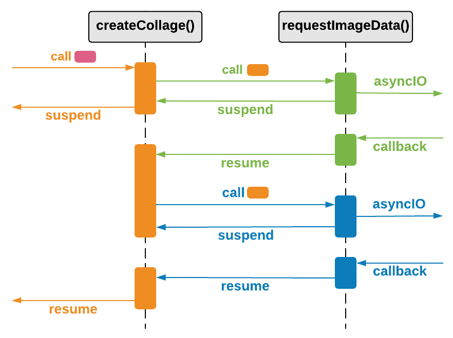

##### Timeouts

```kotlin
val fastImageOrNull: BufferedImage? = withTimeoutOrNull(100) {
    loadFastestImage("dogs", 20)
}
```
<span class="fragment current-only" data-code-focus="1"></span>

---

##### Timeouts und Selects

```kotlin
suspend fun loadFastestImage(query: String, count: Int, timeoutMs: Long): BufferedImage {
    val urls = requestImageUrls(query, count)
    val deferredImages = urls.map {
        async { requestImageData(it) }
    }
    val image: BufferedImage = select {
        for (deferredImage in deferredImages) {
            deferredImage.onAwait { image ->
                image
            }
        }

        onTimeout(timeoutMs) {
            DEFAULT_IMAGE
        }
    }
    return image
}
```
<span class="fragment current-only" data-code-focus="6,13-15"></span>

---

##### Continuation

```kotlin
public interface Continuation<in T> {
    public val context: CoroutineContext

    //Die unterbrochene Continuation beim gespeicherten
    //Label mit dem Wert wieder starten
    public fun resume(value: T)

    //Die unterbrochene Continuation beim gespeicherten
    //Label mit einer Exception wieder starten.
    public fun resumeWithException(exception: Throwable)
}
```

<small class="fragment current-only" data-code-focus="6"></small>
<small class="fragment current-only" data-code-focus="10"></small>

---

##### Koroutinen



---

##### Producer / Consumer

* Synchronisation von Erzeugern und Verarbeitern

---

##### Producer

```kotlin
suspend fun retrieveImages(
    query: String
): ReceiveChannel<BufferedImage> = produce {
    while (isActive) {
        try {
            val url = requestImageUrl(query)
            val image = requestImageData(url)
            send(image)
            delay(2, TimeUnit.SECONDS)
        } catch (exc: Exception) {
            delay(1, TimeUnit.SECONDS)
        }
    }
}

val dogsChannel = retrieveImages("dogs")
val catsChannel = retrieveImages("cats")

```

<span class="fragment current-only" data-code-focus="3"></span>
<span class="fragment current-only" data-code-focus="8"></span>
<span class="fragment current-only" data-code-focus="16,17"></span>

---

##### Consumer

```kotlin
suspend fun createCollage(
    count: Int,
    vararg channels: ReceiveChannel<BufferedImage>
): BufferedImage {
  ...
  selectUnbiased<BufferedImage> {
      channels.forEach { channel ->
          channel.onReceive { it }
      }
  }
  ...
}

createCollage(4, catsChannel, dogsChannel)
```

<span class="fragment current-only" data-code-focus="1-4"></span>
<span class="fragment current-only" data-code-focus="6"></span>
<span class="fragment current-only" data-code-focus="7-9"></span>
<span class="fragment current-only" data-code-focus="14"></span>

---

##### Von Suspend zum reaktivem Stream (Publish)

```kotlin
fun createCollageAsMono(
    query: String, count: Int
): Mono<BufferedImage> = mono {
    val urls = requestImageUrls(query, count)
    val images = urls.map { requestImageData(it) }
    val newImage = combineImages(images)
    newImage
}
```
<small class="fragment current-only" data-code-focus="1,3"></small>
<small class="fragment current-only" data-code-focus="4,5">Das Mono ist erst vollständig wenn die Koroutine fertig ist.</small>

---

##### Timeouts und Selects

```kotlin
suspend fun loadFastestImage(query: String, count: Int, timeoutMs: Long): BufferedImage {
    val urls = requestImageUrls(query, count)
    val deferredImages = urls.map {
        async { requestImageData(it) }
    }
    val image: BufferedImage = select {
        for (deferredImage in deferredImages) {
            deferredImage.onAwait { image ->
                image
            }
        }

        onTimeout(timeoutMs) {
            DEFAULT_IMAGE
        }
    }
    return image
}
```
<span class="fragment current-only" data-code-focus="6,13-15"></span>


